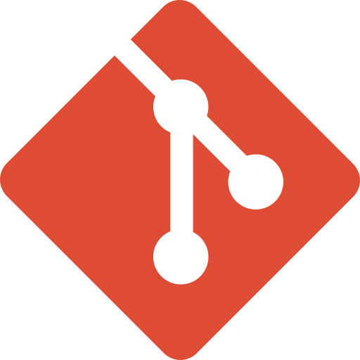

<h1 align="center">Hi 👋, I'm Breno Albuquerque</h1>
<h3 align="center">Full Stack Devoloper Student at Trybe</h3>

### 📫 How to reach me:

- Website: -...-
- Linkedin: [@Breno Albuquerque](https://www.linkedin.com/in/breno-albuquerque/)
- Email: brenoralbu@hotmail.com

### Languages and Tools:  

<code></code>
<code></code>
<code></code>
<code></code>
<code></code>
<code></code>

---

### Stats

